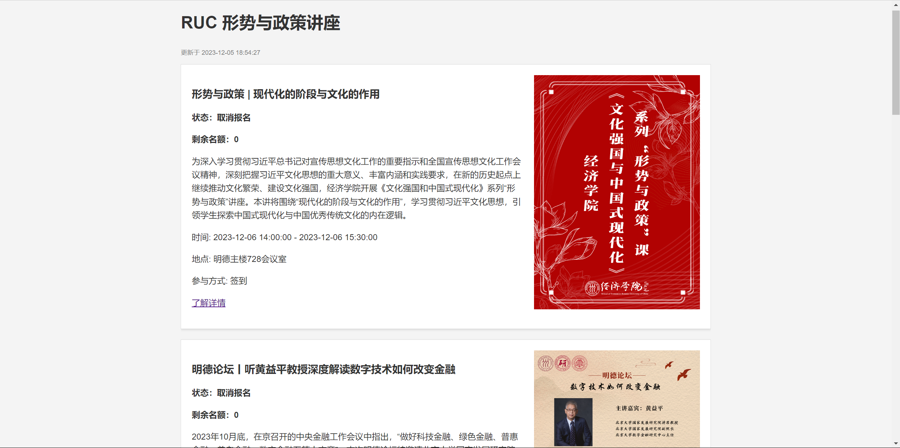

# RUC 形势与政策讲座

一个更易用的讲座查询系统，用你的学号和密码登录即可查询到你可以报名的形势与政策讲座，并支持邮箱提醒。



### How to use

```bash
git clone git@github.com:panjd123/rucxszc.git
cd rucxszc
pip install -r requirements.txt
ruclogin --username 2021201212 --password ABC12345 --browser Chrome --driver ""
python web.py
```

然后根据 flask 的输出在例如 http://127.0.0.1:5000 上访问

[ruclogin](https://github.com/panjd123/ruclogin) 是一个自动获取微人大 cookies 的工具

### 重要须知

如果打开了解详情为空白页，尝试先登陆[微人大](https://v.ruc.edu.cn/campus#/index)让浏览器保存 cookies

### Q&A

Q: 为什么报错 `Could not reach host. Are you offline?`

A: 本脚本依赖于包 `ruclogin`，其使用 `webdriver_manager` 管理浏览器驱动，如果你的网络环境无法访问 google 相关的网页将会遇到该报错。你可以通过 `ruclogin --driver D:/chromedriver.exe` 指定本地的浏览器驱动解决。
